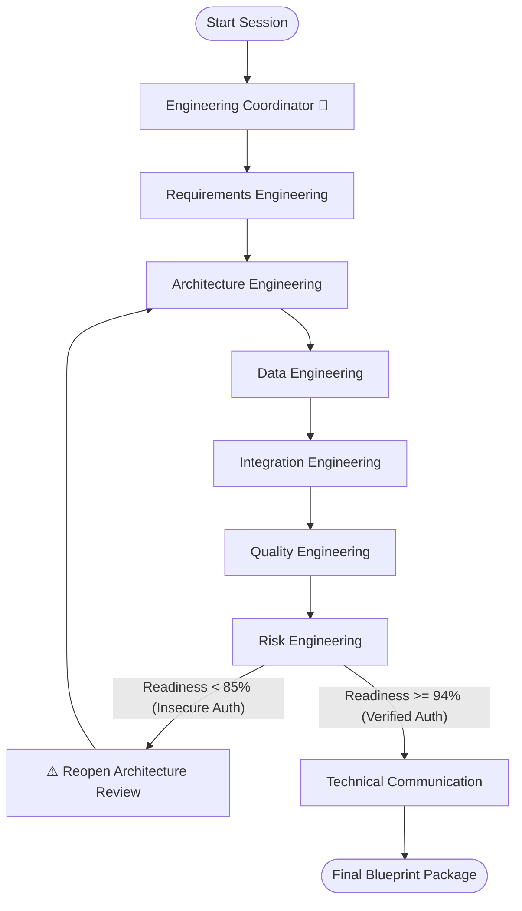

# ArchitectOS

> Every Idea. Expertly Engineered.

ArchitectOS is the first collaborative engineering platform where specialized engineering disciplines work together to transform ideas into engineering-ready solutions.

---

## Problem Statement

Every successful software product begins with collaboration between specialists. Product managers, business analysts, architects, database engineers, API designers, testers, security reviewers, and technical writers each contribute unique expertise before a single line of production code is written.

Today, AI can generate software remarkably quickly, but most AI tools still behave as isolated assistants. They produce answers rather than engineering outcomes, often skipping the collaborative review process that experienced software teams rely on. This leads to incomplete requirements, overlooked risks, inconsistent designs, and solutions that require significant human refinement.

ArchitectOS addresses this challenge by recreating the collaborative engineering process. Instead of relying on a single AI assistant, ArchitectOS orchestrates a team of specialized engineering disciplines that contribute according to their expertise, review each other's work, and continuously improve the engineering package while keeping humans in control.

---

## Vision

To empower innovators, product teams, and software engineers to transform a raw software ideas into engineering-ready blueprints through collaborative AI engineering disciplines.

---

## Key Features

- **3-Column Engineering Dashboard:** A single unified interface displaying project inputs, real-time collaboration dialogues, and compile-time blueprints side-by-side.
- **Collaborative Dialogue Logs:** Threaded, real-time logging of the discussions, trade-off debates, and review checks made by the engineering disciplines.
- **Automated Self-Correction Loop:** Integrated security audit checks that automatically trigger upstream revisions if vulnerabilities (like missing rate limits or authentication credentials) are detected.
- **Spec-Driven Blueprints:** Compiled specifications structured into tabbed panels covering Requirements, Architecture, Database DDLs, API schemas, and Test matrices.

---

## Engineering Workflow

The session progresses sequentially through the following specialist discipline stages:



1. **Engineering Coordinator:** Aligns the session boundaries and parameters.
2. **Requirements Engineering:** Outlines functional specifications and latency targets.
3. **Architecture Engineering:** Models system components and patterns.
4. **Data Engineering:** Designs database relations and DDL structures.
5. **Integration Engineering:** Maps REST API contracts (OpenAPI).
6. **Quality Engineering:** Formulates Jest, Playwright, and k6 test metrics.
7. **Risk Engineering:** Performs threat audits, rates readiness, and manages retries.
8. **Technical Communication:** Gathers, compiles, and formats the unified blueprint package.

---

## Architecture Diagram

```text
       +--------------------------------------------------------+
       |                     FRONTEND SPA                       |
       |                (React + TS + Vite)                     |
       +---------------------------+----------------------------+
                                   |
                                   | HTTP POST (fetch)
                                   v
       +--------------------------------------------------------+
       |                     BACKEND API                        |
       |                      (FastAPI)                         |
       |                                                        |
       |   +------------------+          +------------------+   |
       |   |  models/schemas  |          |  api/main router |   |
       |   +--------+---------+          +--------+---------+   |
       |            |                             |             |
       |            +------------+   +------------+             |
       |                         v   v                          |
       |                +--------------------+                  |
       |                |    orchestrator/   |                  |
       |                |    coordinator     |                  |
       |                +--------+-----------+                  |
       |                         |                              |
       |                         v                              |
       |                +--------------------+                  |
       |                |    agents/         |                  |
       |                |    specialists     |                  |
       |                +--------+-----------+                  |
       |                         |                              |
       +-------------------------+------------------------------+
                                 |
                                 | Client SDK Call / Fallback
                                 v
                     +-----------------------+
                     |  Google Gemini API    |
                     |  (gemini-2.5-flash)   |
                     +-----------------------+
```

---

## Technologies

- **Frontend:** React 18, TypeScript, Vite 8, Vanilla CSS (using flexible CSS variables and container queries).
- **Backend:** FastAPI, Pydantic, Uvicorn, python-dotenv, Python 3.10.
- **Generative AI:** Official Google GenAI SDK (`google-genai`) calling `gemini-2.5-flash` with a robust local template generator fallback.

---

## Course Concepts Demonstrated

| Course Concept | ArchitectOS Implementation |
| :--- | :--- |
| **Multi-Agent Collaboration** | Engineering Coordinator orchestrates specialist disciplines |
| **Antigravity IDE** | Entire project developed using Antigravity IDE |
| **Gemini API** | Generates engineering specifications and specialist dialogue |
| **Specification-Driven Development** | Produces Engineering Blueprint before implementation |
| **Security Guardrails** | Risk Engineering reviews architecture before approval |

---

## Project Structure

```text
architectos-ai/
├── README.md                   # Story-first project overview
├── PRODUCT_VISION.md            # Vision, mission, and philosophy
│
├── frontend/                   # React Single Page App
│   ├── src/
│   │   ├── components/         # Reusable layouts and components
│   │   ├── pages/Home/         # Workspace dashboard pages and styles
│   │   └── App.tsx             # Root routing mounting sheet
│   └── package.json            # Vite compiling rules
│
└── backend/                    # Python FastAPI service
    ├── requirements.txt        # Backend dependencies
    └── app/                    # Modular application code
        ├── main.py             # Router HTTP entrypoint
        ├── models/             # Pydantic schemas
        ├── services/           # Gemini API connections
        ├── agents/             # Specialist personas
        ├── orchestrator/       # Session workflow and retry loops
        └── skills/             # Behavioral skill contracts
```

---

## Getting Started

### Backend API
1. Navigate to the backend directory:
   ```bash
   cd backend
   ```
2. Activate your virtual environment and run the server:
   ```bash
   source .venv/bin/activate
   uvicorn app.main:app --reload --port 8000
   ```
   *The backend will be live at `http://localhost:8000`.*

### Frontend SPA
1. Navigate to the frontend directory:
   ```bash
   cd frontend
   ```
2. Start the dev compiler:
   ```bash
   npm run dev
   ```
   *The frontend will be live at `http://localhost:5173`.*

---

## Why ArchitectOS?

Unlike traditional AI coding assistants that generate isolated responses, ArchitectOS recreates the collaborative engineering process by allowing specialized engineering disciplines to plan, review, challenge, and improve ideas before producing a final engineering blueprint.

The result is not simply generated content—it is an engineering-ready solution prepared for human review.

---

## Future Roadmap

- **Live MCP tool integration:** Integrate with active Model Context Protocol (MCP) server endpoints.
- **Scaffolding Generator:** Automate code scaffolding from the verified database and OpenAPI schemas.
- **State Rewinding:** Add a UI button to allow rolling back to previous specialist turns for revision.
