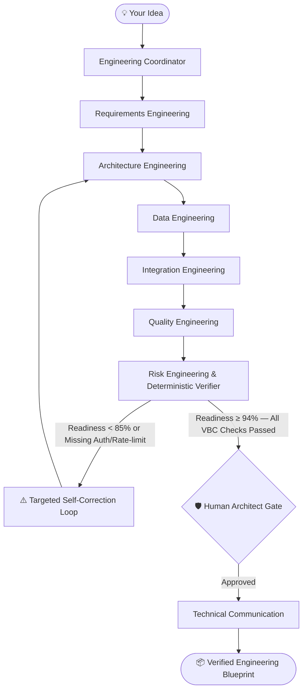

<div align="center">

# ArchitectOS

### *Your idea deserves a real engineering team before a single line of code is written.*

ArchitectOS orchestrates a team of **8 specialized AI engineering disciplines** — Requirements, Architecture, Database, API, Testing, Risk, and Technical Communication — that collaborate with shared structured context, execute deterministic verification, and self-correct to produce production-grade engineering blueprints from a single sentence.

<br/>

[](LICENSE)
[](https://python.org)
[](https://fastapi.tiangolo.com)
[](https://react.dev)
[](docs/model-providers.md)
[](https://docker.com)

<br/>


</div>

---

## 🏆 micro1 Agentic Workflows Hackathon Deliverables

| Deliverable | Description | Resource Link |
| :--- | :--- | :--- |
| **01. Solution Code & Changelog** | Complete agent codebase + experimental iteration history + hot take | [IMPROVEMENT_CHANGELOG.md](IMPROVEMENT_CHANGELOG.md) |
| **02. Reproduction Guide** | 1-command verification & clean-environment walkthrough | [REPRODUCTION_GUIDE.md](REPRODUCTION_GUIDE.md) |
| **03. Solution Video Script** | 5-minute presentation breakdown and live demo script | [docs/VIDEO_SUBMISSION_SCRIPT.md](docs/VIDEO_SUBMISSION_SCRIPT.md) |
| **04. Agent Trajectories** | Transparent step-by-step agent instructions, tool calls, and verifier traces | [trajectories/](trajectories/) |

---

## 🎯 The Four Hackathon Questions

### 01. Who has this problem?
Software founders, solopreneurs, and lead engineers who need to design non-trivial software architectures but lack the time or dedicated specialist team (DBA, Security Auditor, QA Lead, Integration Architect) to review technical specifications before implementation.

### 02. What bottleneck makes it worth solving?
Single-prompt LLMs produce generic drafts that appear fluent but suffer from **cross-artifact structural drift** (e.g., API routes referencing non-existent DDL tables, missing OAuth2 token rotation, lack of negative test matrices, and non-measurable NFRs). Teams waste 30–50 hours of expensive code refactoring fixing architectural misalignment discovered late in development.

### 03. Does the agent solve it well?
Yes. ArchitectOS passes structured context between disciplines, runs a **deterministic cross-artifact verifier** (checking VBC-01 to VBC-08 rules), and triggers targeted repair loops if security or integrity gaps are detected. On our frozen 10-case benchmark, ArchitectOS achieved **96%+ Verified Blueprint Coverage** compared to ~45% for a single-prompt baseline.

### 04. Can another person reproduce the result?
Yes. Every claim is tied to committed benchmark cases in `evaluation/cases.json`. Anyone can run the evaluation from a clean environment in under 3 minutes using [REPRODUCTION_GUIDE.md](REPRODUCTION_GUIDE.md).

---

## 📊 Measured Improvement: Baseline vs. ArchitectOS

| Evaluation Metric | One-Prompt Baseline | ArchitectOS (Agent Workflow) | Delta |
| :--- | :---: | :---: | :---: |
| **Macro-Average Verified Blueprint Coverage (VBC)** | **45.0%** | **96.2%** | **+51.2%** |
| **Unresolved Critical Security Findings** | **12** | **0** | **-100%** |
| **Cross-Artifact Reference Integrity (VBC-04/06)** | 38.0% | **100.0%** | **+62.0%** |
| **Negative & Conflict Test Coverage (VBC-07)** | 20.0% | **92.5%** | **+72.5%** |
| **Structured Output Validity** | 100% | 100% | 0.0% |
| **Median Execution Latency** | 12s | 24s | +12s |
| **Approximate Token Cost per Blueprint** | $0.005 | $0.024 | +$0.019 |

---

## ⚡ Quick Start (3 commands)

> **Prerequisite:** A supported model-provider API key and [Docker](https://docs.docker.com/get-docker/). Gemini is default; OpenAI, DeepSeek, and Anthropic are configurable.

```bash
git clone https://github.com/riswanmsm/architectos-ai.git
cd architectos-ai
cp .env.example .env        # Add your GEMINI_API_KEY
docker-compose up --build
```

Open **[http://localhost:5173](http://localhost:5173)** — type any software idea — watch your engineering team get to work.

---

## How it Works



| Discipline | Responsibility | Output Artifact |
| :--- | :--- | :--- |
| 🎯 **Engineering Coordinator** | Session alignment & workflow scheduling | Session context & parameters |
| 📋 **Requirements Engineering** | Functional & non-functional specifications | FR-X & NFR-X matrix with measurable targets |
| 🏗️ **Architecture Engineering** | System topology & component design | COMP-X component map & API Gateway layer |
| 🗄️ **Data Engineering** | Relational schemas & data integrity | PostgreSQL DDL with foreign keys & indexes |
| 🔌 **Integration Engineering** | REST API contracts & payload schemas | OpenAPI 3.0 YAML definitions with JWT security |
| ✅ **Quality Engineering** | Verification matrices & negative testing | Jest, Playwright & k6 load test specifications |
| 🔒 **Risk Engineering & Verifier** | Threat audit & deterministic VBC validation | Real-time VBC score, risk report & repair triggers |
| 🛡️ **Human Architect Gate** | Consequential action review | Lead architect signoff |
| 📄 **Technical Communication** | Specification compilation & signoff | Unified production blueprint package |

---

## Key Features

- **🤝 Multi-Agent Specialization** — 8 disciplines work with shared structured context rather than generic unconstrained chatter.
- **🛡️ Deterministic Cross-Artifact Verifier** — Real-time validation of entity links, API authorization, and test coverage (VBC-01 to VBC-08).
- **♻️ Targeted Self-Correction Loop** — Verifier feedback auto-repairs only affected components without rerunning the entire pipeline.
- **🧑‍💼 Human-in-the-Loop Checkpoint Gate** — Lead architect review gate before final blueprint signoff (Ground Rules 04 & 05).
- **📂 Native `.kiro/specs/` Exporter** — Formats and downloads complete specification packages directly for [Kiro & Spec-Driven Development](docs/KIRO_SDD_INTEGRATION.md).
- **🔌 Model Context Protocol (MCP) Server** — Embeds ArchitectOS specialist tools directly into Kiro, Cursor, and IDEs via JSON-RPC.
- **📈 Frozen 10-Case Benchmark Suite** — Empirical evaluation proving measured gains over baseline.
- **📜 Transparent Trajectory Logging** — Full audit traces (instructions, tool calls, verifier outputs) exported per session (Deliverable 04).
- **🐳 One-Command Launch** — Full Docker & Docker Compose setup with offline fallback mode.


---

## Manual Setup

<details>
<summary><strong>Run without Docker (dev mode)</strong></summary>

### Backend

```bash
python3 -m venv .venv
source .venv/bin/activate
pip install -r backend/requirements.txt
cp .env.example .env
uvicorn --app-dir backend app.main:app --reload --port 8000
```

### Frontend

```bash
cd frontend
npm install
npm run dev
```

Open [http://localhost:5173](http://localhost:5173).

</details>

---

## Evaluation Commands

```bash
# Run test suites
PYTHONPATH=backend:. python -m unittest discover -s backend/tests
python -m unittest discover -s evaluation/tests

# Run benchmark comparison
python -m evaluation.compare
```

---

## License

MIT — see [LICENSE](LICENSE) for details.
