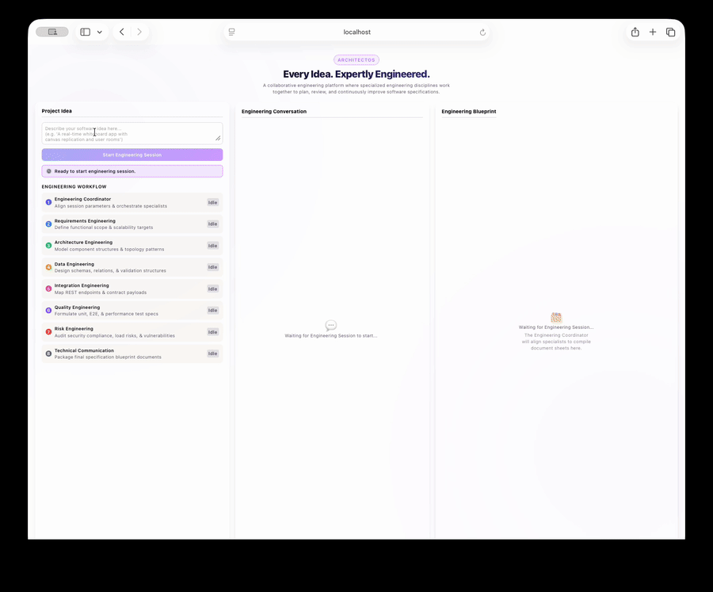
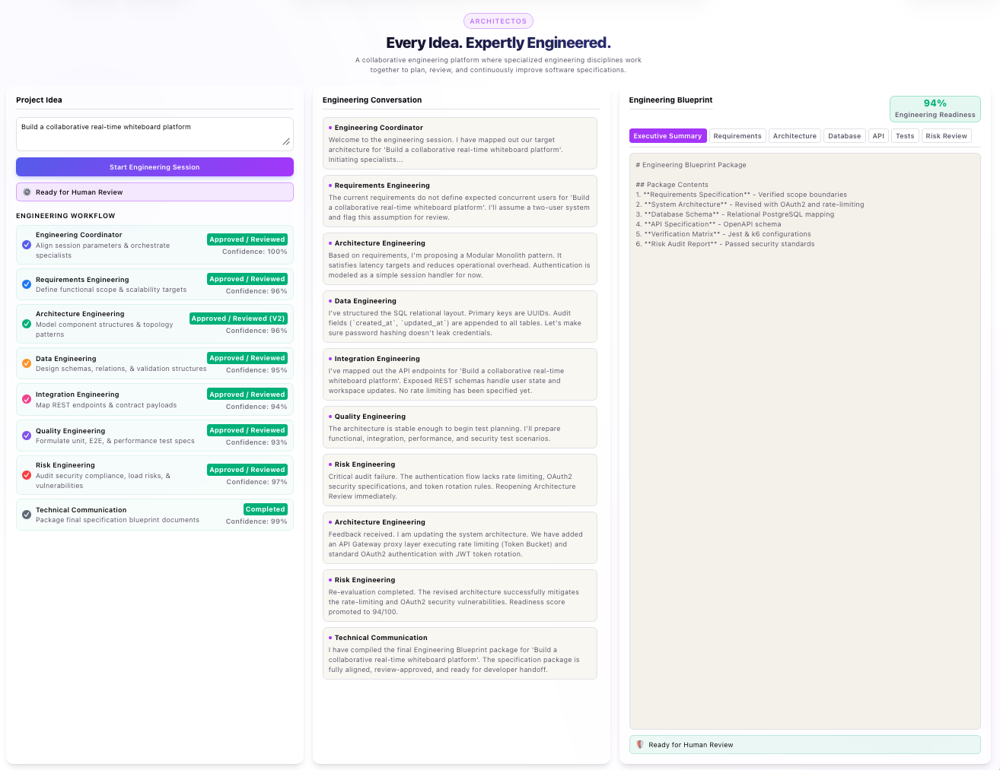
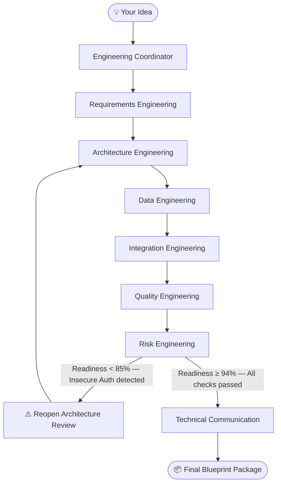
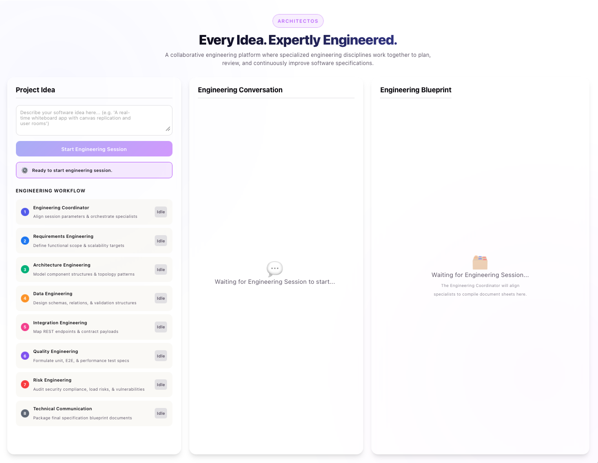
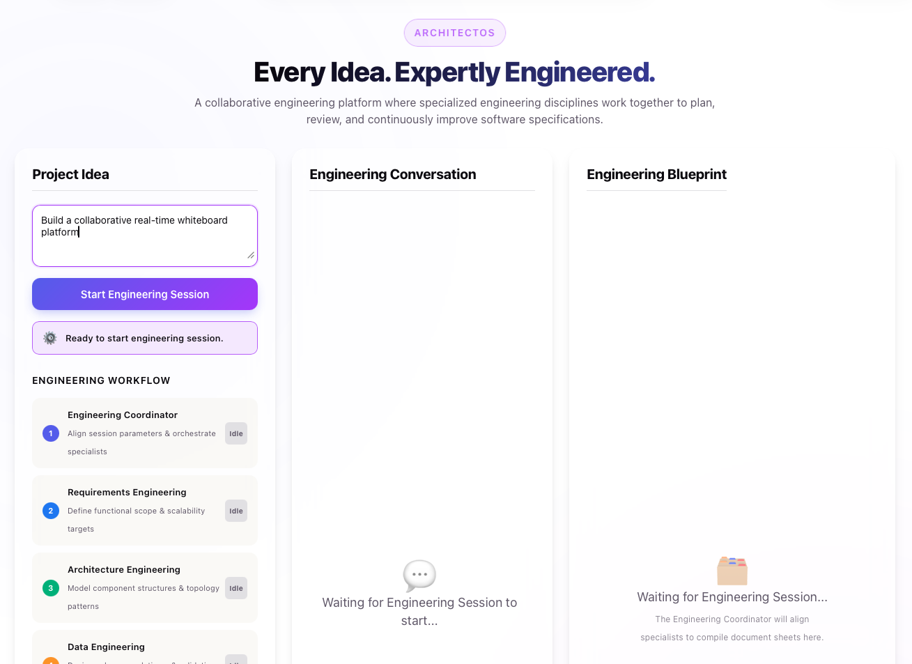
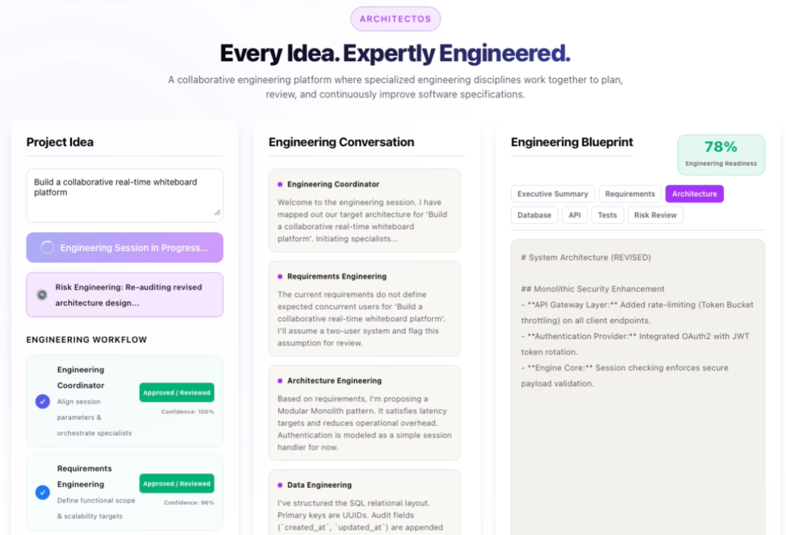
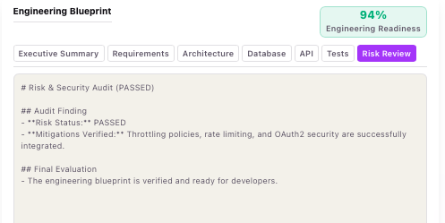

<div align="center">

# ArchitectOS

### *Your idea deserves a real engineering team before a single line of code is written.*

ArchitectOS orchestrates a team of **8 specialized AI engineering disciplines** — Requirements, Architecture, Database, API, Testing, Risk, and more — that collaborate, debate, and self-correct to produce a complete engineering blueprint from a single sentence.

<br/>

[](LICENSE)
[](https://python.org)
[](https://fastapi.tiangolo.com)
[](https://react.dev)
[](docs/model-providers.md)
[](https://docker.com)

<br/>



</div>

---

## ⚡ Quick Start (3 commands)

> **Prerequisite:** A supported model-provider API key and [Docker](https://docs.docker.com/get-docker/). Gemini is the default; OpenAI, DeepSeek, and Anthropic are configurable.

```bash
git clone https://github.com/riswanmsm/architectos-ai.git
cd architectos-ai
cp .env.example .env        # select a provider/model and add its key
docker-compose up --build
```

Open **[http://localhost:5173](http://localhost:5173)** — type any software idea — watch your engineering team get to work.

> **No Docker?** See the [manual setup guide](#manual-setup) below.

---

## What is ArchitectOS?

Most AI tools act as a single, isolated assistant. You ask a question, you get an answer. There's no push-back, no risk review, no specialization.

**ArchitectOS is different.** It recreates the way real engineering teams operate — by orchestrating a committee of specialist AI agents that each own a domain, challenge each other's work, and self-correct before handing off a final blueprint.

You describe your idea. Your engineering team handles the rest.

<div align="center">

</div>

---

## How it Works

Type a software idea. ArchitectOS runs it through 8 sequential engineering disciplines, each generating a section of your blueprint. If Risk Engineering finds a security flaw, it **automatically reopens Architecture** and runs a correction loop before proceeding.



| Discipline | Output |
| :--- | :--- |
| 🎯 **Engineering Coordinator** | Session alignment & scope parameters |
| 📋 **Requirements Engineering** | Functional (FR) & Non-Functional (NFR) specs |
| 🏗️ **Architecture Engineering** | System topology & component design |
| 🗄️ **Data Engineering** | PostgreSQL DDL schemas & entity relations |
| 🔌 **Integration Engineering** | OpenAPI 3.0 REST contract definitions |
| ✅ **Quality Engineering** | Jest, Playwright & k6 test matrices |
| 🔒 **Risk Engineering** | Threat audit, readiness score, retry loop |
| 📄 **Technical Communication** | Unified, packaged blueprint document |

---

## Screenshots

<div align="center">

| Landing Page | Engineering Session |
|:---:|:---:|
|  |  |

| Architecture Review Reopened | Risk Review |
|:---:|:---:|
|  |  |

</div>

---

## Key Features

- **🤝 Multi-Agent Collaboration** — 8 specialist disciplines work as a coordinated team, not a single chatbot
- **♻️ Automated Self-Correction Loop** — Risk Engineering detects security gaps and automatically triggers upstream revision
- **📐 Spec-Driven Blueprints** — Tabbed output panels for Requirements, Architecture, DDL, API, Tests, and Risk Report
- **💬 Transparent Dialogue Log** — Every agent decision, debate, and trade-off is logged in real time
- **🛡️ Graceful Fallback** — Works fully offline with pre-built templates if the Gemini API is unavailable
- **🐳 One-Command Docker Launch** — Zero manual setup required

---

## Tech Stack

| Layer | Technology |
| :--- | :--- |
| **Frontend** | React 18, TypeScript, Vite, Vanilla CSS |
| **Backend** | FastAPI, Pydantic, Uvicorn, Python 3.10 |
| **AI** | Provider-neutral adapters for Gemini, OpenAI-compatible APIs, DeepSeek, and Anthropic |
| **Container** | Docker + Docker Compose |
| **Agent Design** | Custom orchestrator + skill-contract system |

---

## Manual Setup

<details>
<summary><strong>Run without Docker (dev mode)</strong></summary>

### Backend

```bash
# Run from the repository root so the shared provider package is importable.
python -m venv backend/.venv
source backend/.venv/bin/activate        # Windows: backend\.venv\Scripts\activate
pip install -r backend/requirements.txt
cp .env.example .env                     # select provider/model and add its key
uvicorn --app-dir backend app.main:app --reload --port 8000
```

### Frontend

```bash
cd frontend
npm install
npm run dev
```

Open [http://localhost:5173](http://localhost:5173).

</details>

---

## Project Structure

```
architectos-ai/
├── .env.example                # Environment variable template
├── docker-compose.yml          # One-command launch
├── architectos_llm/            # Shared model-provider adapters
├── config/providers.json       # Provider, model, and pricing registry
├── evaluation/                 # Baseline, rubric, cases, and evidence
├── backend/
│   ├── Dockerfile
│   ├── requirements.txt
│   └── app/
│       ├── main.py             # FastAPI entrypoint
│       ├── models/             # Pydantic schemas
│       ├── services/           # Provider-neutral LLM service
│       ├── agents/             # Specialist agent personas & prompts
│       ├── orchestrator/       # Session routing & self-correction loop
│       └── skills/             # Behavioral skill contracts (markdown)
└── frontend/
    ├── Dockerfile
    └── src/
        ├── components/         # Reusable UI components
        └── pages/Home/         # Main 3-column workspace
```

---

## Roadmap

- [ ] **Live MCP tool integration** — connect real schema validators and API linters
- [ ] **Code scaffolding engine** — generate a runnable starter repo from the verified blueprint
- [ ] **State rewinding** — roll back to any specialist step and revise
- [ ] **Multi-user sessions** — collaborative review with persistent storage
- [ ] **Export to PDF / GitHub repo** — one-click handoff to your dev team

---

## Contributing

Contributions are welcome! Please open an issue first to discuss what you'd like to change.

1. Fork the repository
2. Create a feature branch (`git checkout -b feature/your-feature`)
3. Commit your changes (`git commit -m 'Add your feature'`)
4. Push and open a Pull Request

---

## License

MIT — see [LICENSE](LICENSE) for details.

---

<div align="center">

**Built with [Google Gemini](https://ai.google.dev) · Developed using [Antigravity IDE](https://antigravity.dev)**

*Great software is engineered through collaboration, not generation.*

⭐ If ArchitectOS saved you time, please star this repo — it helps others find it!

</div>
