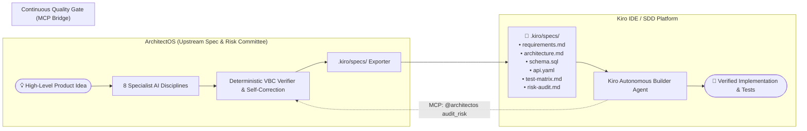

# ArchitectOS + Kiro / Spec-Driven Development (SDD) Integration Guide

This guide details how **ArchitectOS** operates as the **Upstream Ideation & Pre-Flight Architecture Engine** for **Kiro** and the broader Spec-Driven Development (SDD) ecosystem.

---

## 🏗️ The Problem: The "Garbage-In, Garbage-Out" Trap in Autonomous Coding

Autonomous agentic coding tools like **Kiro** excel at implementing features when given clear, structured, and unambiguous specifications. However, when developers feed coding agents unstructured or unverified business prompts, coding agents make unvalidated architectural assumptions—leading to:
- Missing database foreign keys and cascading rules
- Unauthenticated or unthrottled API endpoints
- Disconnected requirement-to-test matrices
- Costly downstream refactoring

**ArchitectOS bridges this gap:** It takes rough business intent, runs an 8-specialist engineering committee, verifies cross-artifact integrity deterministically, and outputs clean `.kiro/specs/` packages ready for Kiro execution.



---

## 📁 Native `.kiro/specs/` Bundle Layout

ArchitectOS exports specifications directly matching Kiro's directory convention:

```text
my-project/
└── .kiro/
    └── specs/
        ├── requirements.md     # FR-X & NFR-X with measurable targets & acceptance criteria
        ├── architecture.md     # System topology, COMP-X boundaries & API gateway design
        ├── schema.sql          # PostgreSQL DDL with UUID primary keys, foreign keys & indexes
        ├── api.yaml            # OpenAPI 3.0 contract with JWT Bearer security schemes
        ├── test-matrix.md      # Jest, Playwright & k6 scenarios with negative assertions
        └── risk-audit.md       # Pre-flight security audit report & VBC readiness score
```

### Exporting via API:
- **JSON Payload:** `GET /api/session/{session_id}/export/kiro`
- **ZIP Download:** `GET /api/session/{session_id}/export/kiro/zip`

---

## 🔌 Model Context Protocol (MCP) Server Integration

ArchitectOS exposes a native **MCP Server** (`/api/mcp`) so developers inside Kiro or any MCP-compatible IDE (Cursor, Claude Desktop, Antigravity) can invoke the specialist committee on-demand.

### 1. Register ArchitectOS in Kiro / MCP Client Config:

Add the following to your `kiro_config.json` or `mcp_config.json`:

```json
{
  "mcpServers": {
    "architectos": {
      "url": "http://localhost:8000/api/mcp/jsonrpc",
      "transport": "http"
    }
  }
}
```

### 2. Available MCP Tools:

| MCP Tool Name | Description | Example Prompt |
| :--- | :--- | :--- |
| `architectos_generate_blueprint` | Runs the full 8-agent committee and returns verified `.kiro/specs/`. | `@architectos generate a multi-tenant subscription SaaS with Stripe webhooks` |
| `architectos_verify_spec` | Deterministically validates existing specs against VBC-01 to VBC-08 rules. | `@architectos verify cross-artifact consistency for .kiro/specs/` |
| `architectos_audit_risk` | Pre-flight security audit flagging missing rate-limits or auth before task execution. | `@architectos audit risk for .kiro/specs/api.yaml` |

---

## 🛡️ Pre-Flight Risk Audit Hook for Kiro

To prevent Kiro from generating code against flawed specifications, configure ArchitectOS as a **Pre-Execution Quality Gate**:

1. Developer asks Kiro to implement a feature from a draft spec.
2. Kiro calls `architectos_audit_risk` via MCP.
3. If critical vulnerabilities are found (e.g. unauthenticated API routes or missing idempotency keys), ArchitectOS returns the exact repair recommendations.
4. Kiro fixes the specification **before** generating code.

---

## 🚀 Example End-to-End Workflow

1. **Step 1:** Founder enters idea into ArchitectOS:
   > *"A field inspection tool where workers complete checklists offline and sync photos later."*
2. **Step 2:** ArchitectOS coordinates Requirements $\rightarrow$ Architecture $\rightarrow$ DDL $\rightarrow$ OpenAPI $\rightarrow$ Tests $\rightarrow$ Risk Review.
3. **Step 3:** Deterministic verifier ensures offline sync conflict resolution and photo access controls are specified.
4. **Step 4:** Developer downloads the `.kiro/specs/` zip bundle and places it in the repository root.
5. **Step 5:** Kiro opens `.kiro/specs/` and autonomously implements the features with 100% architectural alignment.
