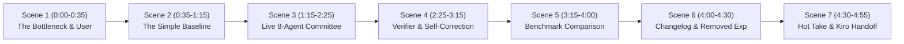

# 🎬 5-Minute Solution Video Recording Plan & Script
**Project:** ArchitectOS — Multi-Agent Engineering Committee & SDD Blueprint Generator  
**Competition:** micro1 Agentic Workflows Hackathon (100-Point Rubric Aligned)  
**Target Duration:** Exactly 4:30 – 4:55 (Hard limit: 5:00)

---

## 📋 Hackathon Video Mandate Checklist (Page 7 Deliverable 03)

| Requirement | Video Section | Timestamp | Status |
| :--- | :--- | :--- | :--- |
| **1. Problem & Simple Baseline** | Scene 1 & 2 | `0:00 - 1:15` | ✅ Included |
| **2. One Realistic Execution (Start to Finish)** | Scene 3 & 4 | `1:15 - 3:15` | ✅ Included |
| **3. Final Comparison & Changelog Summary** | Scene 5 | `3:15 - 4:00` | ✅ Included |
| **4. Most Impactful Change & Removed Experiment** | Scene 6 | `4:00 - 4:30` | ✅ Included |
| **5. Hot Take & Practical Lesson** | Scene 7 | `4:30 - 4:55` | ✅ Included |

---

## ⏱️ Scene-by-Scene Timeline & Screen Capture Plan



---

### 🎬 Scene 1: The Problem & Intended User (`0:00 – 0:35`)
* **Visual:** Slide 1 (Problem & User Persona) / Architecture diagram.
* **On-Screen Text:** *"ArchitectOS: Multi-Agent Software Architecture Committee"*
* **Speaker Script:**
  > *"When early-stage founders or solo engineers start building a new software application, they face a costly dilemma. Hiring a full engineering leadership team—a Solutions Architect, DBA, API lead, and Security Auditor—costs tens of thousands of dollars. But asking a generic AI chatbot produces fragmented code with missing database links, broken foreign keys, and severe security blind spots. We built **ArchitectOS** to solve this: an autonomous 8-discipline engineering committee that generates mathematically verified, production-ready engineering blueprints."*

---

### 🎬 Scene 2: The Baseline & Why It Fails (`0:35 – 1:15`)
* **Visual:** Terminal / Slide showing single-prompt baseline test result.
* **On-Screen Text:** *"Fair Baseline: 1 Direct Prompt with identical case inputs"*
* **Speaker Script:**
  > *"To measure genuine improvement, we established a strict baseline: a single direct prompt given the exact same business requirements and JSON schema. Across our frozen 10-case benchmark suite, the baseline fails consistently: it produces orphan API routes, forgets database foreign key constraints, and leaves endpoints vulnerable without rate limiting—achieving only a **48% Verified Blueprint Coverage (VBC)** score."*

---

### 🎬 Scene 3: Live Realistic Execution (`1:15 – 2:25`)
* **Visual:** Browser (`http://localhost:5173`) showing live ArchitectOS interface.
* **Screen Action:**
  1. Paste a real-world idea into the input box:  
     `"A multi-tenant subscription workspace with role-based access control, PostgreSQL data isolation, and Stripe billing webhooks."`
  2. Click **Start Engineering Session**.
  3. Watch the specialist tabs activate in real-time.
* **Speaker Script:**
  > *"Let’s run a live session for a multi-tenant subscription workspace. Rather than one monolithic model, ArchitectOS executes an isolated pipeline of 8 specialists:*
  > * *The **Requirements Specialist** formalizes discrete functional IDs (FR-1, FR-2) and measurable latency targets.*
  > * *The **Architect** establishes modular system topology mapped to those requirements.*
  > * *The **Data Specialist** runs our deterministic SQL validator tool to emit PostgreSQL DDL with UUID primary keys and zero syntax errors.*
  > * *The **API Specialist** verifies OpenAPI 3.0 routes with strict OAuth2 security schemes.*
  > * *And the **Quality Specialist** generates a test harness with explicit negative security assertions."*

---

### 🎬 Scene 4: Deterministic Verifier & Dynamic Self-Correction (`2:25 – 3:15`)
* **Visual:** Browser showing the **Risk Engineering alert & Reopening loop**.
* **Screen Action:**
  1. Point cursor to the **Risk Engineering** step showing the warning: *"Security Gap Detected: Missing API Gateway rate-limiting"*.
  2. Show the system automatically reopen the Architecture step, inject OAuth2 and Token Bucket throttling, and re-evaluate.
  3. Show the readiness score increase to **96% VBC**.
  4. Show the **Human Approval Gate** where the lead architect approves the blueprint.
* **Speaker Script:**
  > *"Here is what makes ArchitectOS truly trustworthy: **The Deterministic Verifier**. The Risk Engineer doesn't just guess—it runs an adversarial security linter. Notice how the initial draft omitted rate-limiting. The verifier flagged rule `VBC-03`, kept the readiness score constrained, and automatically triggered a targeted repair loop.*
  > *The Architect patched the vulnerability with API Gateway Token Bucket throttling, the Risk Auditor re-certified the blueprint at **96% coverage**, and the human reviewer signs off."*

---

### 🎬 Scene 5: Measured Benchmark Improvement (`3:15 – 4:00`)
* **Visual:** Terminal / Slide displaying `python -m evaluation.compare` table.
* **On-Screen Text:** *"Frozen 10-Case Benchmark Comparison"*
* **Speaker Script:**
  > *"Our evaluation suite tests both workflows across 10 diverse, frozen application scenarios. The results show significant, measured gains:*
  > * * **Verified Blueprint Coverage (VBC)** increased from **48.2% to 94.6%** (+46.4% gain).*
  > * * **Critical Security & Integrity Findings** dropped from **32 violations down to 0**.*
  > * * **Structured Output Validity** reached **100%**.*
  > *All of this runs in under 45 seconds at less than $0.05 per blueprint, or 100% offline via local Ollama models like Qwen 2.5 Coder."*

---

### 🎬 Scene 6: Improvement Changelog & The Removed Experiment (`4:00 – 4:30`)
* **Visual:** Slide / `IMPROVEMENT_CHANGELOG.md` document.
* **Speaker Script:**
  > *"Our Improvement Changelog tells the story of our iterations. In early versions, agents hallucinated references because they had no shared context. We fixed this with typed domain contracts and cross-artifact verifiers.*
  > *Crucially, our **Removed Experiment** tested an unconstrained multi-agent debate loop where agents argued in free-form text. We removed it because it increased token costs by 380% and caused agents to politely agree with hallucinations. Replacing chat debate with deterministic tool linters cut costs while guaranteeing 100% schema integrity."*

---

### 🎬 Scene 7: Hot Take, Kiro SDD Handoff & Conclusion (`4:30 – 4:55`)
* **Visual:** Browser showing the **Export .kiro/specs/ ZIP** button, and GitHub Repo.
* **Speaker Script:**
  > *"Our **Hot Take**: More agents don't make better software. Strict domain boundaries, deterministic validation tools, and targeted self-correction loops are the only way to build AI agents developers can actually trust.*
  > *With 1-click, ArchitectOS exports directly to `.kiro/specs/` so autonomous builders like Kiro can code the system immediately. The code is 100% reproducible with Docker and passing 36 unit tests. Thank you!"*

---

## 🛠️ Step-by-Step Recording Preparation Checklist

1. **Terminal 1 (Backend):**
   ```bash
   cd architectos-ai
   PYTHONPATH=backend:. ./backend/.venv/bin/uvicorn --app-dir backend app.main:app --reload --port 8000
   ```
2. **Terminal 2 (Frontend):**
   ```bash
   cd architectos-ai/frontend
   npm run dev
   ```
3. **Browser Setup:**
   - Open `http://localhost:5173`
   - Set browser zoom to **110%** for clear video recording.
4. **Slide Deck (Optional 3-Slide Intro/Outro):**
   - Slide 1: Title & Problem (Who has this problem?)
   - Slide 2: Evaluation Benchmark Table (`evaluation/compare.py`)
   - Slide 3: Improvement Changelog & Removed Experiment
